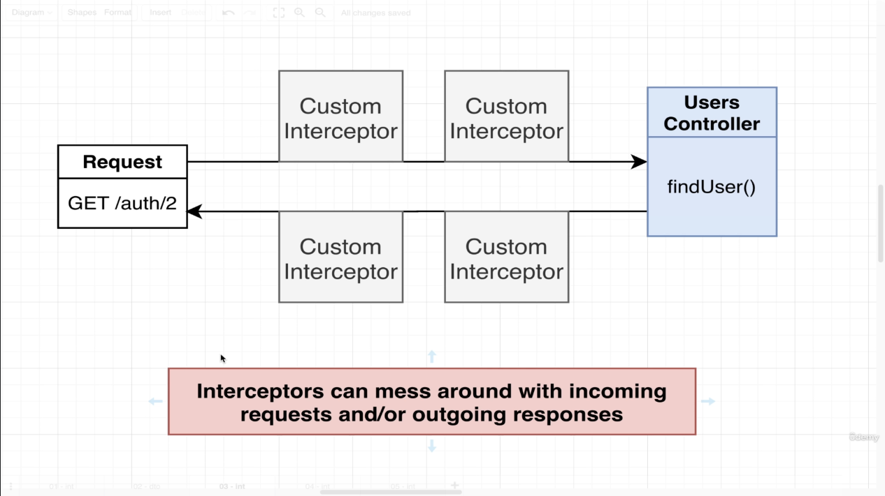
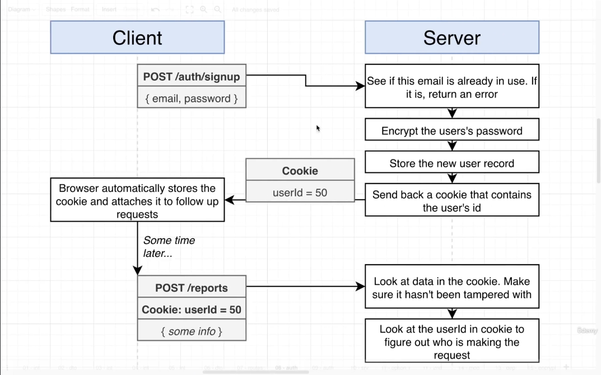
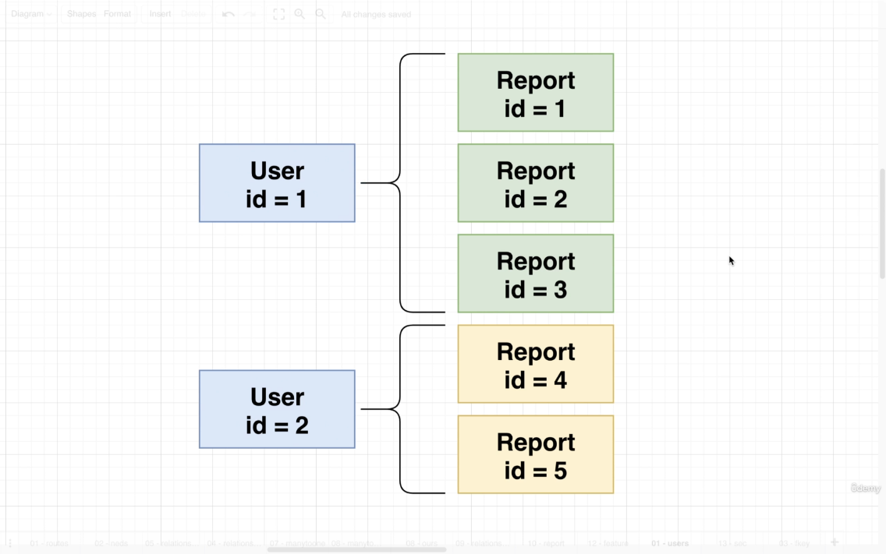
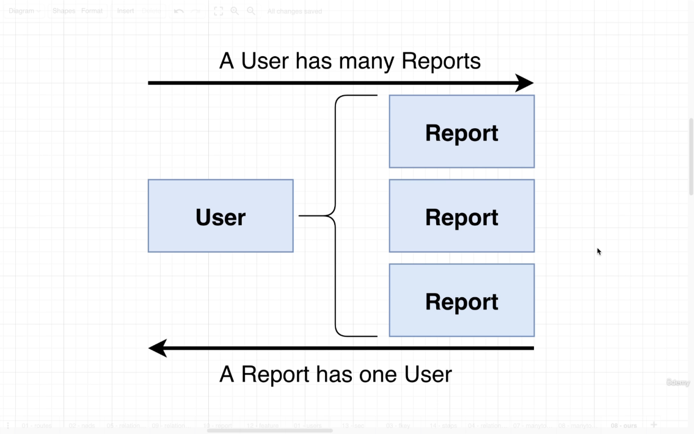

# Services and Repositories
<br/>

**Repositories:** Repositories are classes or components that encapsulate the logic required to access data sources. They centralize common data access functionality, providing better maintainability and decoupling the infrastructure or technology used to access databases from the domain model layer.

**Services:** Services is a class that uses one or more repositories to find or store data. 
<hr></hr>

## Difference between services and repositories:
<br/>


## Service and repository class mapping (in general):


<hr></hr>

## Inversion of Control principle and Dependency Injection (DI) Pattern:
The Inversion-of-Control (IoC) pattern, is about providing any kind of callback, which "implements" and/or controls reaction, instead of acting ourselves directly (in other words, inversion and/or redirecting control to the external handler/controller).<br>
Dependency injection is an inversion of control (IoC) technique wherein you delegate instantiation of dependencies to the IoC container (in our case, the NestJS runtime system), instead of doing it in your own code imperatively.


> Bad way to write code according to inversion of control principle:
```TS
export class MessagesService {
  messagesRepo: MessagesRepository;
  constructor() {
    // DONT DO THIS IN REAL APP. Use dependency injection instead.
    this.messagesRepo = new MessagesRepository();
  }
}
```

> Better Way to write the above code:
```TS
export class MessagesService {
    messagesRepo: MessagesRepository;

    constructor(messagesRepo: MessagesRepository) {
        this.messagesRepo = messagesRepo;
    }
}
```

> Best way to write above code
```TS
interface Repository {
  findOne(id: string);
  findAll();
  create(content: string);
}
export class MessagesService {
  messagesRepo: Repository;
  constructor(repo: Repository) {
    this.messagesRepo = repo;
  }
}
```


Why the last case is actually good...

In the 'better' way to write code, we pass the 'MessagesRepository' itself as the dependency when initializing the class, but in case of 'best' way of writing the code, we just want the repository to have to conform to a specific interface. In this way, we can migrate to a different database if we wanted to, just by plugging in the repository of the new database that conforms to the interface. We can also write different code for the repository for testing and production environments.


The DI container instantiates dependencies of each class for us and makes sure only one instance of the dependency is created and will use that instance for instantiating other classes, if required.


## Section 6
In this section, we create a small project to understand the concept of 'DI' (Dependency Injection) between modules.

This project imitates a computer with four different modules for each part of the computer.


Project architecture:


For this project, we need to share code between different modules as shown in image below:


Steps for sharing code inside of a module:


Steps for sharing code between modules:


## Section 7
In this section, we will start with building an API that is used to report pricing of used cars.


API routes (More routes will be added in future):


Modules, controllers, services and repositories for this project:


## Section 8

Nest provides tight integration with TypeORM and Sequelize out-of-the-box with the <code>@nestjs/typeorm</code> and <code>@nestjs/sequelize</code> packages respectively and Mongoose with <code>@nestjs/mongoose</code>. These integrations provide additional NestJS-specific features, such as model/repository injection, testability, and asynchronous configuration to make accessing the chosen database even easier. For ease of setup, this project will initially use SQLite and will eventually migrate to PostgreSQL.


Connection to the database will be made in App Module and will be shared across all the modules (users and reports module). Inside of each module (except App module), an entity file should be created. An entity defines a single resource to store in database (just like schema in Mongoose).


Setting up database connection in App module:

```TS
// app.module.ts
import { TypeOrmModule } from '@nestjs/typeorm';

@Module({
  imports: [
    TypeOrmModule.forRoot({
      type: 'sqlite',
      database: 'db.sqlite',
      entities: [],
      synchronize: true,
    }),
    UsersModule,
    ReportsModule,
  ],
  controllers: [AppController],
  providers: [AppService],
})
export class AppModule { }
```

Steps to create an entity:


Step 1: Create an entity file:
```TS
// users/user.entity.ts

import { Entity, Column, PrimaryGeneratedColumn } from "typeorm";

@Entity()
export class User {
    @PrimaryGeneratedColumn()
    id: number;

    @Column()
    email: string;

    @Column()
    password: string;
}
```

Step 2: Update the module the entity belongs to:
```TS
// users/users.module.ts

import { TypeOrmModule } from '@nestjs/typeorm';
import { User } from './user.entity';

@Module({
  imports: [TypeOrmModule.forFeature([User])],
  controllers: [UsersController],
  providers: [UsersService]
})
export class UsersModule { }
```

Step 3: Update App module:
```TS
// app.module.ts

import { TypeOrmModule } from '@nestjs/typeorm';
import { User } from './users/user.entity';
import { Report } from './reports/report.entity';
// import ...

@Module({
  imports: [
    TypeOrmModule.forRoot({
      type: 'sqlite',
      database: 'db.sqlite',
      entities: [User, Report],
      synchronize: true,
    }),
    UsersModule,
    ReportsModule,
  ],
  controllers: [AppController],
  providers: [AppService],
})
export class AppModule { }
```

Extra routes for the app:


## Section 9

Current flow of the signup request:


Difference between <code>create</code> and <code>save</code> methods in repository.

|Create|Save|
|------|----|
|<code>Create</code> method creates an instance of an entity (just like in mongoose, an instance of a model is created with the <code>new</code> keyword). |<code>Save</code> method saves the data to the database |


Benefits of inserting data using <code>create</code> and <code>save</code> method instead of just passing an object directly to <code>save</code> method:
```TS
const user = this.repo.create({ email, password });
this.repo.save(user);

// VS

this.repo.save({ email, password });
```

| Using create & save | Using save only |
|-----------------|------|
|In this method, we can use TypeORM's built-in hooks to perform operation after inserting data into database| In this method, we have to build all features from scratch |

Handling exceptions:
In this case, there is a users controller that communicates over HTTP with the client and throwing a <code>NotFoundException</code> from users service back to the controller will work because <code>NotFoundException</code> works only with HTTP protocol. If we have a controller that communicates over WebSocket or gRPC, then NotFoundException won't work. In this case, we will have to use exception filters for WebSocket or gRPC. Nest has <code>WsException</code> class for WebSocket protocol.


## Section 10

Excluding properties from response.
In this case, we remove 'password' property from 'user' entity.

Current request/response flow:


### Method 1: Official method recommended by NestJS


Step 1: Add <code>Exclude</code> decorator to the property we want to exclude from the response
```TS
// user.entity.ts
import { Exclude } from 'class-transformer';

@Exclude()
password: string;
```

Step 2: Add interceptors
```TS
// users.controller.ts
import { UseInterceptors, ClassSerializerInterceptor } from '@nestjs/core'

@UseInterceptors(ClassSerializerInterceptor)
@Get('/auth/:id')
async findUser(@Param('id') id: string)
// ...
```

### Drawback of using the 1st (nest recommended) method for excluding properties from response:

For example, we have two types of routes, one for admins and other is a public route for querying information of a user. We want admin users to view all information about a user and limit it for a normal user. With the first method discussed above, this is just not possible as we have added a decorator in the user entity file to remove some fields from the response which cannot be customised based on different routes. This drawback can be solved by using a custom interceptor and DTOs (Data Transfer Objects).


### Method 2: Using custom interceptor




Step 1: Create a dto
```TS
// user.dto.ts
import { Expose } from 'class-transformer'

export class UserDto {
    @Expose()
    id: number;

    @Expose()
    email: string;
}
```

Step 2: Create custom interceptor
```TS
// serialize.interceptor.ts
import { UseInterceptors, NestInterceptor, ExecutionContext, CallHandler } from '@nestjs/common';
import { Observable } from 'rxjs';
import { map } from 'rxjs/operators';
import { plainToInstance } from 'class-transformer'

interface ClassConstructor {
    new (...args: any[]): object
}

export function Serialize(dto: ClassConstructor) {
    return UseInterceptors(new SerializeInterceptor(dto));
}

export class SerializeInterceptor implements NestInterceptor {
    private dto: any; 

    constructor(dto: any) {
        this.dto = dto
    }

    intercept(context: ExecutionContext, next: CallHandler<any>): Observable<any> | Promise<Observable<any>> {
        // Run something before a request is handled by the request handler.

        return next.handle().pipe(
            map((data: any) => {
                // Run something before response is sent out
                const result =  plainToInstance(this.dto, data, {
                    excludeExtraneousValues: true
                });
                return result;
            })
        )
    }
}
```

Step 3: Add the custom interceptor in controller file
```TS
// users.controller.ts
import { Serialize } from 'src/interceptors/serialize.interceptor';
import { UserDto } from './dtos/user.dto';

@Controller('auth')
@Serialize(UserDto)
export class UsersController {

  @Post('/signup')
  createUser(@Body() body: CreateUserDto) {
      this.usersService.create(body.email, body.password);
  }
}
```

## Section 11

In this section, we will be implementing authentication for our application. There are two ways we can do this:
1. adding user authentication logic inside 'Users' service and 
2. creating a new 'Auth' service that depends on 'Users' service.

The drawback of first option is that, in future, we would want to add extra features like preferences, reset password and other features and all of this will be present in 'Users' service, making it a very large file. To prevent this, second option is preferred over first in large applications.


### Hierarchy of classes in users module:

In the diagram below, Auth Service imports Users service to access Users repository.


### Signup flow diagram:




### Signin flow diagram:


### Common auth system features


### Get signed in user with custom decorator and interceptor

**Step 1: Create a custom decorator:**
```TS
// src/users/decorators/current-user.decorator.ts
import { createParamDecorator, ExecutionContext } from "@nestjs/common";

export const CurrentUser = createParamDecorator((data: never, context: ExecutionContext) => {
    const request = context.switchToHttp().getRequest();
    return request.currentUser;
});
```

**Step 2: Create an interceptor**
```TS
import { NestInterceptor, ExecutionContext, CallHandler, Injectable } from '@nestjs/common';
import { UsersService } from '../users.service';

@Injectable()
export class CurrentUserInterceptor implements NestInterceptor {
    constructor(private usersService: UsersService) { }

    async intercept(context: ExecutionContext, next: CallHandler<any>) {
        const request = context.switchToHttp().getRequest();
        const { userId } = request.session || {};
        if (userId) {
            const user = await this.usersService.findOne(userId);
            request.currentUser = user;
        }

        return next.handle();
    }
}
```

**Step 3: Connecting the interceptor**

There are two ways to connect the interceptor:
 1. **Connecting the interceptor to a specific controller:** <br>
    In this method, an interceptor can only intercept requests inside the current controller it is applied to. If we would like to use the interceptor in other controllers, we would have to import the interceptor in each of the controllers we wish to use it in and connect it to the controller. This can lead to code duplication and will make it harder to manage code. 

    

    **Steps to connect the interceptor to a controller:**

    **Step 1: Add the interceptor to the providers list of users module**
    ```TS
    // users.module.ts
    import { CurrentUserInterceptor } from './interceptors/current-user.interceptor';

    @Module({
      ...,
      providers: [..., CurrentUserInterceptor]
    })
    export class UsersModule { }
    ```

    **Step 2: Use the interceptor inside the controller**
    ```TS
    import { ..., UseInterceptors } from '@nestjs/common';
    import { CurrentUserInterceptor } from './interceptors/current-user.interceptor';

    @UseInterceptors(CurrentUserInterceptor)
    export class UsersController {
      ...
    }
    ```

 2. **Connecting the interceptor globally:** <br>
    In this method, the interceptor is used for the whole application, for each controller and route. One downside for this method is that the interceptor will perform its operation even if some of the controllers doesnot need its features.
   
    

    To connect the interceptor globally, add the interceptor inside the providers list of users module using APP_INTERCEPTOR

    ```TS
    // users.module.ts
    import { CurrentUserInterceptor } from './interceptors/current-user.interceptor';
    import { APP_INTERCEPTOR } from '@nestjs/core';

    @Module({
      ...,
      providers: [..., { provide: APP_INTERCEPTOR, useClass: CurrentUserInterceptor }]
    });
    export class UsersModule { }
    ```

### Authentication guards<br>
Guards determine whether a given request will be handled by the route handler or not, depending on certain conditions (like permissions, roles, ACLs, etc.) present at run-time. A guard is a class annotated with the <code>@Injectable()</code> decorator, which implements the <code>CanActivate</code> interface. Every guard must implement a <code>canActivate()</code> function. This function should return a boolean, indicating whether the current request is allowed or not.

A gaurd can be applied to different locations as required by the application: 


Create an auth guard:
```TS
// src/guards/augth.guard.ts
import { CanActivate, ExecutionContext } from '@nestjs/common';
import { Observable } from 'rxjs';

export class AuthGuard implements CanActivate {
    canActivate(context: ExecutionContext): boolean | Promise<boolean> | Observable<boolean> {
        const request = context.switchToHttp().getRequest();

        return request?.session?.userId;
    }
}
```

Use guard for a specific route in controller:
```TS
// src/users/users.controller.ts
import { ... , UseGuards } from '@nestjs/common';
import { AuthGuard } from 'src/guards/auth.guard';

export class UsersController {
    ...

    @Get('/whoami')
    @UseGuards(AuthGuard)
    whoAmI(@CurrentUser() user: User) {
        return user;
    }
}
```

## Section 12

### Types of testing: 

|Unit testing|Integration testing|
|------------|-------------------|
|Makes sure individual methos on a class are working correctly| Tests the full coverage of a feature|
|Testing files have <code>.spec</code> of <code>.test</code> suffix| Testing files have <code>.e2e-spec</code> suffix|
|Test files are placed near the classes they test| Test files are placed inside <code>test</code> directory|

### Testing <code>AuthService</code> class

To test AuthService class, we need to create an instance of this class to call methods inside it. Since AuthService class depends on UsersService class, we need its instance as well and since UsersService class depends on UsersRepository which in turn depends on SQLite and its configuration, we need to create all these dependencies which is time consuming. To overcome this, we create an instance of AuthService class by passing a fake UsersService class defined inside the test file that has only the methods we require while testing.


When app runs normally, DI container has a mapping of all classes and their dependencies. During testing we will create a testing DI container that has AuthService and our fake UsersService class.


Test file for AuthService class
```TS
import { Test } from "@nestjs/testing";
import { AuthService } from "./auth.service";
import { UsersService } from "./users.service";
import { User } from "./user.entity";

it('can create an instance of auth service', async () => {

    const fakeUsersService: Partial<UsersService> = {
        find: () => Promise.resolve([]),
        create: (email: string, password: string) => Promise.resolve({id: 1, email, password} as User)
    }

    const module = await Test.createTestingModule({
        providers: [AuthService, {provide: UsersService, useValue: fakeUsersService}]
    }).compile();

    const service = module.get(AuthService);

    expect(service).toBeDefined();
});
```

In the above code snippet, the providers array inside <code>createTestingModule</code>, has all the classes we want to register inside the DI container. Within providers array, we have AuthService and an object. The <code>provide</code> key inside the object means that if someone asks for a class mentioned against this key, give them the class mentioned against <code>useValue</code> key. In case above, the DI container will provide <code>fakeUsersService</code> whenever a class requires <code>UsersService</code>.


## Section 13

In an end-to-end test, entire workflow of the application is tested. End-to-end test mimics how software operates in real life by running common user scenarios and identifying any errors or malfunctions. In an end-to-end test, an entire instance of our nest app is created and listens to a random port on the computer and then makes request to this random port to test the feature. For every end-to-end test, a brand new test application is created, so if we have for example five tests, then five instances of the application will be created.


End-toend test file for users controller

```TS
import { Test, TestingModule } from '@nestjs/testing';
import { INestApplication } from '@nestjs/common';
import * as request from 'supertest';
import { AppModule } from './../src/app.module';

describe('Authentication System', () => {
  let app: INestApplication;

  beforeEach(async () => {
    const moduleFixture: TestingModule = await Test.createTestingModule({
      imports: [AppModule],
    }).compile();

    app = moduleFixture.createNestApplication();
    await app.init();
  });

  it('/auth/signup (POST)', () => {
    const email = 'abc@email.com';

    return request(app.getHttpServer())
      .post('/auth/signup')
      .send({ email, password: 'abcdefg' })
      .expect(201)
      .then((res) => {
        const {id, email} = res.body;
        expect(id).toBeDefined();
        expect(email).toEqual(email);
      })
  });
});
```

During active development, both users module and reports module gets imported into the app module. App module is then imported into <code>main.ts</code> file and there we run a bootstrap funtion where we configure <code>cookie-session</code> middleware and validation pipe. 
During testing, app module is imported and an instance of the application is initialized without configuring the middleware and validation pipe. This results in the above signup test to fail as there is no session object to assign userId to. 


To fix the error occuring the in test due to middleware and validation pipe configuration, we move its configuration from <code>main.ts</code> file to <code>app.module.ts</code> file.

Step 1: Remove validation pipe and middleware configuration in main.ts file. The file should look like as shown in code block below:

```TS
// main.ts
import { NestFactory } from '@nestjs/core';
import { AppModule } from './app.module';

async function bootstrap() {
  const app = await NestFactory.create(AppModule);
  await app.listen(3000);
}
bootstrap();
```

Step 2: Setup validation pipe in the provider list of app module decorator and middleware in the <code>AppModule</code> class.

```TS
// app.module.ts

...
@Module({
  ...
  providers: [
       { 
         provide: APP_PIPE,
         useValue: new ValidationPipe({ whitelist: true })
       }
    ],
  })


export class AppModule {
  configure(consumer: MiddlewareConsumer) {
    consumer.apply(
      cookieSession({
        keys: ['cookieSession']
      })
    ).forRoutes('*');
  }
}
```

Error thrown if same test is run again.
Running the <code>/auth/signup (POST)</code> test again will throw a <code>400 Bad Request</code> error because the first run of the test created an account with an email and this email is used again hence, an error is thrown. This can be solved by using two databases one for development and other for testing. The testing database will be wiped out before running each test preventing any data leak between the tests.


To create a new database instance, we just have to change a single string inside app module. This can be changed by simply using the ternary operator with environment variables. This is not the recommended way of handling environment variables by Nestjs.


```TS
@Module({
  imports: [
    TypeOrmModule.forRoot({
      type: 'sqlite',
      database: process.env.NODE_ENV === 'test' ? 'test.sqlite' : 'db.sqlite',
      entities: [User, Report],
      synchronize: true,
    }),
    ...
  ],
})
```

Nest recommended way of handling environment variables is by using nest module - <code>@nestjs/config</code>


```TS
// src/app.module.ts
...
import { ConfigModule, ConfigService } from '@nestjs/config';

@Module({
  imports: [
    ConfigModule.forRoot({
      isGlobal: true,
      envFilePath: `.env.${process.env.NODE_ENV}`
    }),
    TypeOrmModule.forRootAsync({
      inject: [ConfigService],
      useFactory: (config: ConfigService) => {
        return {
          type: 'sqlite',
          database: config.get<string>('DB_NAME'),
          synchronize: true,
          entities: [User, Report]
        }
      }
    }),
    ...
  ],
})
```
In the above code snippet, <code>ConfigModule</code> is used to specify which env file we want to read and <code>ConfigService</code> to read and expose information inside the file to the application.


Deleting database in between tests:
To delete sqlite database in between tests, we will make use of a global <code>beforeEach</code> function that runs before each test is executed.

**Step 1: Configure jest option**
```TS
{
  // test/jest-e2e.json
  ...
  "setupFilesAfterEnv": ["<rootDir>/setup.ts"]
}
```

**Step 2: Write global <code>beforeEach</code> function to delete <code>test.sqlite</code> file**
```TS
// test/setup.ts

import {rm} from 'fs/promises';
import {join} from 'path';

global.beforeEach(async () => {
    try{
        await rm(join( __dirname, '..', 'test.sqlite'));
    }
    catch(error) {
        console.log("Error in deleting 'test.sqlite' file");
    }
});
```

#### 'SQLITE_BUSY: database is locked' error when running test
Jest runs all e2e tests simultaneously and all tests try to create a connection to SQLite test database which SQLite doesnot allow and hence, an error occurs. It can be fixed by appending <code>--maxWorkers=1</code> in <code>test:e2e</code> script in <code>package.json</code> file.
```TS
// package.json

{
  "scripts": {
    ...
    "test:e2e": "cross-env NODE_ENV=test jest --config ./test/jest-e2e.json --maxWorkers=1"
  }
}

```

## Section 15

### Association (Relations) in TypeORM

In TypeORM, relationships exist between tables in the database. When one of the tables has a foreign key that references the primary key of the other table, a relationship exists. This feature enhances the power and efficiency with which relational databases store information.

In general, relationships can be divided into four types.
1. One-to-one relationship
2. One-to-many relationship
3. Many-to-one relationship
4. Many-to-many relationship

In this project, we need to create a relationship between a user and a report. Since a user can have multiple reports, it falls into one-to-many relationship category.






### Steps to create association (relations) with Nest and TypeORM


**Step 1: Identify type of association to create**

**Step 2: Add decorators to related entities**
```TS
// user.entity.ts
import { ... , OneToMany } from "typeorm";
import { Report } from "src/reports/report.entity";

@Entity()
export class User {
    ...

    @OneToMany(() => Report, (report) => report.user)
    reports: Report[];
}
```

```TS
// report.entity.ts
import { ManyToOne } from "typeorm";
import { User } from "src/users/user.entity";

@Entity()
export class Report {
    ...

    @ManyToOne(() => User, (user) => user.reports)
    user: User;
}
```


**Step 3: Associate user when a report is created**

 - Extract user info from the incoming request:
```TS
// reports.controller.ts
import { CurrentUser } from 'src/users/decorators/current-user.decorator';
import { User } from 'src/users/user.entity';

...
export class ReportsController {
    createReport(@Body() body: CreateReportDto, @CurrentUser() user: User) {
        return this.reportsService.create(body, user);
    }
}
```
 - Assign the user to the report instance then save

```TS
// reports.service.ts
import { User } from 'src/users/user.entity';

export class ReportsService {
    
    create(reportDto: CreateReportDto, user: User) {
        const report = this.repo.create(reportDto);
        report.user = user;

        return this.repo.save(report);
    }
}
```


### References:
* https://stackoverflow.com/questions/3058/what-is-inversion-of-control
* https://betterprogramming.pub/implementing-a-generic-repository-pattern-using-nestjs-fb4db1b61cce
* https://docs.nestjs.com/fundamentals/custom-providers#di-fundamentals
* https://medium.com/@kaushiksamanta23/nest-js-tutorial-series-part-3-providers-services-dependency-injection-a093f647ce2e
* https://docs.nestjs.com/techniques/database
* https://docs.nestjs.com/exception-filters
* https://docs.nestjs.com/interceptors
* https://docs.nestjs.com/guards
* https://docs.nestjs.com/fundamentals/testing
* https://dev.to/marienoir/understanding-relationships-in-typeorm-4873