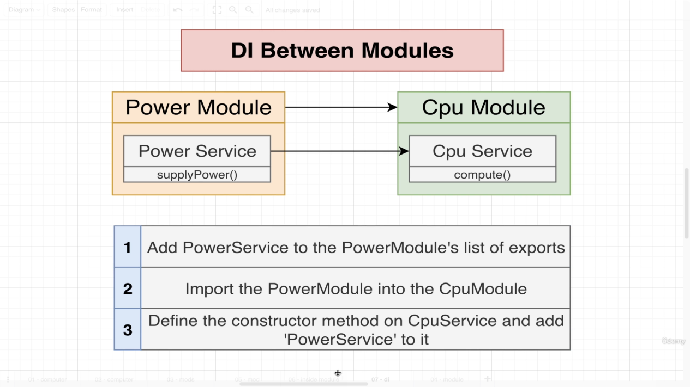
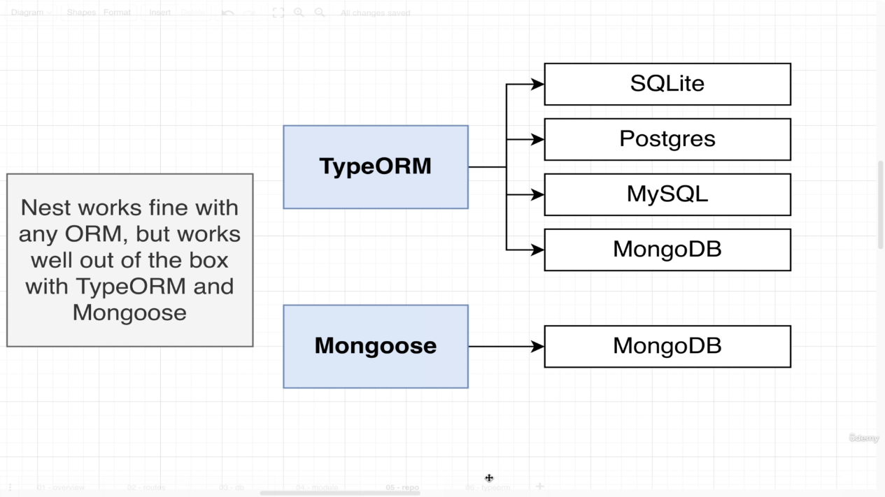
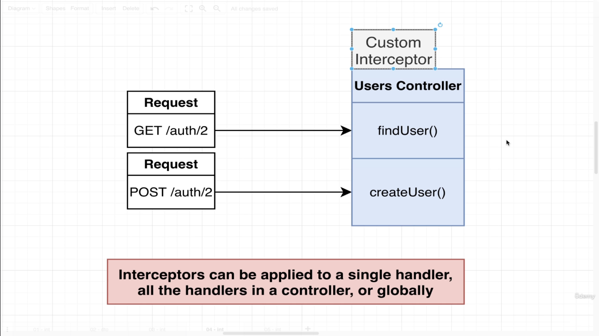

# Services and Repositories
<br/>

**Repositories:** Repositories are classes or components that encapsulate the logic required to access data sources. They centralize common data access functionality, providing better maintainability and decoupling the infrastructure or technology used to access databases from the domain model layer.

**Services:** Services is a class that uses one or more repositories to find or store data. 
<hr></hr>

## Difference between services and repositories:
<br/>


## Service and repository class mapping (in general):


<hr></hr>

## Inversion of Control principle and Dependency Injection (DI) Pattern:
The Inversion-of-Control (IoC) pattern, is about providing any kind of callback, which "implements" and/or controls reaction, instead of acting ourselves directly (in other words, inversion and/or redirecting control to the external handler/controller).<br>
Dependency injection is an inversion of control (IoC) technique wherein you delegate instantiation of dependencies to the IoC container (in our case, the NestJS runtime system), instead of doing it in your own code imperatively.


> Bad way to write code according to inversion of control principle:
```TS
export class MessagesService {
  messagesRepo: MessagesRepository;
  constructor() {
    // DONT DO THIS IN REAL APP. Use dependency injection instead.
    this.messagesRepo = new MessagesRepository();
  }
}
```

> Better Way to write the above code:
```TS
export class MessagesService {
    messagesRepo: MessagesRepository;

    constructor(messagesRepo: MessagesRepository) {
        this.messagesRepo = messagesRepo;
    }
}
```

> Best way to write above code
```TS
interface Repository {
  findOne(id: string);
  findAll();
  create(content: string);
}
export class MessagesService {
  messagesRepo: Repository;
  constructor(repo: Repository) {
    this.messagesRepo = repo;
  }
}
```


Why the last case is actually good...

In the 'better' way to write code, we pass the 'MessagesRepository' itself as the dependency when initializing the class, but in case of 'best' way of writing the code, we just want the repository to have to conform to a specific interface. In this way, we can migrate to a different database if we wanted to, just by plugging in the repository of the new database that conforms to the interface. We can also write different code for the repository for testing and production environments.


The DI container instantiates dependencies of each class for us and makes sure only one instance of the dependency is created and will use that instance for instantiating other classes, if required.


## Section 6
In this section, we create a small project to understand the concept of 'DI' (Dependency Injection) between modules.

This project imitates a computer with four different modules for each part of the computer.


Project architecture:


For this project, we need to share code between different modules as shown in image below:


Steps for sharing code inside of a module:


Steps for sharing code between modules:



## Section 7
In this section, we will start with building an API that is used to report pricing of used cars.


API routes (More routes will be added in future):


Modules, controllers, services and repositories for this project:


## Section 8

Nest provides tight integration with TypeORM and Sequelize out-of-the-box with the <code>@nestjs/typeorm</code> and <code>@nestjs/sequelize</code> packages respectively and Mongoose with <code>@nestjs/mongoose</code>. These integrations provide additional NestJS-specific features, such as model/repository injection, testability, and asynchronous configuration to make accessing the chosen database even easier. For ease of setup, this project will initially use SQLite and will eventually migrate to PostgreSQL.



Connection to the database will be made in App Module and will be shared across all the modules (users and reports module). Inside of each module (except App module), an entity file should be created. An entity defines a single resource to store in database (just like schema in Mongoose).


Setting up database connection in App module:

```TS
// app.module.ts
import { TypeOrmModule } from '@nestjs/typeorm';

@Module({
  imports: [
    TypeOrmModule.forRoot({
      type: 'sqlite',
      database: 'db.sqlite',
      entities: [],
      synchronize: true,
    }),
    UsersModule,
    ReportsModule,
  ],
  controllers: [AppController],
  providers: [AppService],
})
export class AppModule { }
```

Steps to create an entity:


Step 1: Create an entity file:
```TS
// users/user.entity.ts

import { Entity, Column, PrimaryGeneratedColumn } from "typeorm";

@Entity()
export class User {
    @PrimaryGeneratedColumn()
    id: number;

    @Column()
    email: string;

    @Column()
    password: string;
}
```

Step 2: Update the module the entity belongs to:
```TS
// users/users.module.ts

import { TypeOrmModule } from '@nestjs/typeorm';
import { User } from './user.entity';

@Module({
  imports: [TypeOrmModule.forFeature([User])],
  controllers: [UsersController],
  providers: [UsersService]
})
export class UsersModule { }
```

Step 3: Update App module:
```TS
// app.module.ts

import { TypeOrmModule } from '@nestjs/typeorm';
import { User } from './users/user.entity';
import { Report } from './reports/report.entity';
// import ...

@Module({
  imports: [
    TypeOrmModule.forRoot({
      type: 'sqlite',
      database: 'db.sqlite',
      entities: [User, Report],
      synchronize: true,
    }),
    UsersModule,
    ReportsModule,
  ],
  controllers: [AppController],
  providers: [AppService],
})
export class AppModule { }
```

Extra routes for the app:


## Section 9

Current flow of the signup request:


Difference between <code>create</code> and <code>save</code> methods in repository.

|Create|Save|
|------|----|
|<code>Create</code> method creates an instance of an entity (just like in mongoose, an instance of a model is created with the <code>new</code> keyword). |<code>Save</code> method saves the data to the database |


Benefits of inserting data using <code>create</code> and <code>save</code> method instead of just passing an object directly to <code>save</code> method:
```TS
const user = this.repo.create({ email, password });
this.repo.save(user);

// VS

this.repo.save({ email, password });
```

| Using create & save | Using save only |
|-----------------|------|
|In this method, we can use TypeORM's built-in hooks to perform operation after inserting data into database| In this method, we have to build all features from scratch |

Handling exceptions:
In this case, there is a users controller that communicates over HTTP with the client and throwing a <code>NotFoundException</code> from users service back to the controller will work because <code>NotFoundException</code> works only with HTTP protocol. If we have a controller that communicates over WebSocket or gRPC, then NotFoundException won't work. In this case, we will have to use exception filters for WebSocket or gRPC. Nest has <code>WsException</code> class for WebSocket protocol.


## Section 10

Excluding properties from response.
In this case, we remove 'password' property from 'user' entity.

Current request/response flow:


### Method 1: Official method recommended by NestJS


Step 1: Add <code>Exclude</code> decorator to the property we want to exclude from the response
```TS
// user.entity.ts
import { Exclude } from 'class-transformer';

@Exclude()
password: string;
```

Step 2: Add interceptors
```TS
// users.controller.ts
import { UseInterceptors, ClassSerializerInterceptor } from '@nestjs/core'

@UseInterceptors(ClassSerializerInterceptor)
@Get('/auth/:id')
async findUser(@Param('id') id: string)
// ...
```

### Drawback of using the 1st (nest recommended) method for excluding properties from response:

For example, we have two types of routes, one for admins and other is a public route for querying information of a user. We want admin users to view all information about a user and limit it for a normal user. With the first method discussed above, this is just not possible as we have added a decorator in the user entity file to remove some fields from the response which cannot be customised based on different routes. This drawback can be solved by using a custom interceptor and DTOs (Data Transfer Objects).


### Method 2: Using custom interceptor





Step 1: Create a dto
```TS
// user.dto.ts
import { Expose } from 'class-transformer'

export class UserDto {
    @Expose()
    id: number;

    @Expose()
    email: string;
}
```

Step 2: Create custom interceptor
```TS
// serialize.interceptor.ts
import { UseInterceptors, NestInterceptor, ExecutionContext, CallHandler } from '@nestjs/common';
import { Observable } from 'rxjs';
import { map } from 'rxjs/operators';
import { plainToInstance } from 'class-transformer'

interface ClassConstructor {
    new (...args: any[]): object
}

export function Serialize(dto: ClassConstructor) {
    return UseInterceptors(new SerializeInterceptor(dto));
}

export class SerializeInterceptor implements NestInterceptor {
    private dto: any; 

    constructor(dto: any) {
        this.dto = dto
    }

    intercept(context: ExecutionContext, next: CallHandler<any>): Observable<any> | Promise<Observable<any>> {
        // Run something before a request is handled by the request handler.

        return next.handle().pipe(
            map((data: any) => {
                // Run something before response is sent out
                const result =  plainToInstance(this.dto, data, {
                    excludeExtraneousValues: true
                });
                return result;
            })
        )
    }
}
```

Step 3: Add the custom interceptor in controller file
```TS
// users.controller.ts
import { Serialize } from 'src/interceptors/serialize.interceptor';
import { UserDto } from './dtos/user.dto';

@Controller('auth')
@Serialize(UserDto)
export class UsersController {

  @Post('/signup')
  createUser(@Body() body: CreateUserDto) {
      this.usersService.create(body.email, body.password);
  }
}
```


### References:
* https://stackoverflow.com/questions/3058/what-is-inversion-of-control
* https://betterprogramming.pub/implementing-a-generic-repository-pattern-using-nestjs-fb4db1b61cce
* https://docs.nestjs.com/fundamentals/custom-providers#di-fundamentals
* https://medium.com/@kaushiksamanta23/nest-js-tutorial-series-part-3-providers-services-dependency-injection-a093f647ce2e
* https://docs.nestjs.com/techniques/database
* https://docs.nestjs.com/exception-filters